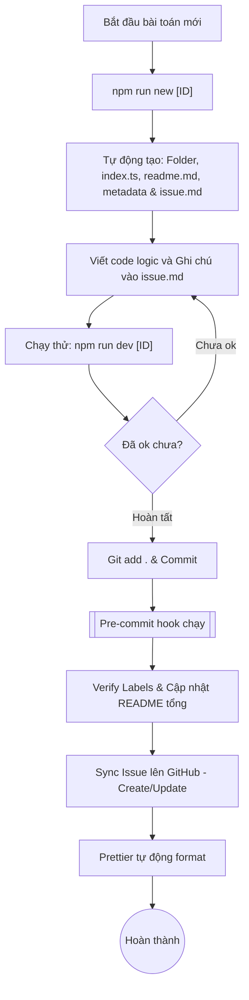

# Quy trình làm việc (Updated)

Sơ đồ quá trình từ khi bắt đầu bài toán đến khi đồng bộ kiến thức lên GitHub:

## Các bước thực hiện chi tiết:

1.  **Khởi tạo tự động:** Chạy lệnh `npm run new <ID>` (ví dụ: `npm run new 49`). Hệ thống sẽ gọi API LeetCode để lấy đề bài, tạo sẵn thư mục, file code, metadata và đặc biệt là file **`issue.md` (Research Note)** theo chuẩn 5W1H.
2.  **Viết code & Nghiên cứu:**
    - Giải toán trong `index.ts`.
    - Ghi chú lại các điểm mấu chốt (Insight) hoặc lỗi sai (Caveats) vào file `issue.md`.
3.  **Chạy thử code:** Dùng lệnh `npm run dev <ID>` để chạy test ngay trên terminal.
4.  **Đồng bộ & Commit:**
    - Sau khi `git add` và `commit`, hệ thống sẽ tự quét các file `issue.md` có thay đổi.
    - **Smart Sync:** Chỉ đồng bộ những bài bạn vừa sửa lên GitHub Issue (Tạo mới hoặc Cập nhật tùy bài).
    - **Auto Index:** Bảng danh sách bài ở trang chủ `README.md` sẽ tự động cập nhật đầy đủ thông tin.

---

_Mẹo: File `issue.md` vẫn được giữ tại local để anh tra cứu nhanh mà không cần lên web._ 🎩🚀🔥
