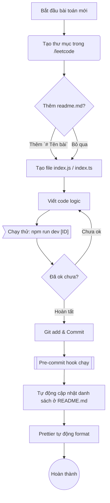

# Quy trình làm việc

Sơ đồ quá trình tạo và commit một bài giải mới:

## Các bước thực hiện:

1. **Khởi tạo tự động:** Chạy lệnh `npm run leetcode <ID>` (ví dụ: `npm run leetcode 202`). Hệ thống sẽ gọi API LeetCode để lấy đề bài, tạo sẵn thư mục `leetcode/202`, file `readme.md`, `metadata.json` chứa format cực chuẩn và file `index.ts` có sẵn code khởi tạo!
2. **Viết code:** Mở `leetcode/<ID>/index.ts` và bắt đầu viết code logic.
3. **Chạy thử code:** Dùng lệnh `npm run dev <ID>` để chạy test bằng terminal.
4. **Commit:** Sau khi code chạy đúng, chỉ việc Git Add và Commit. Hệ thống (qua Pre-commit hook) sẽ tự động chèn dữ liệu vào bảng danh sách bài ở file `readme.md` tổng (với đầy đủ các cột như Độ khó, Tags, Link gốc) và format lại đẹp mắt.
